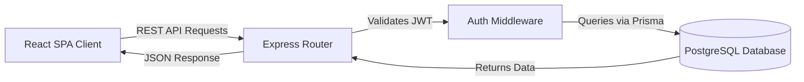
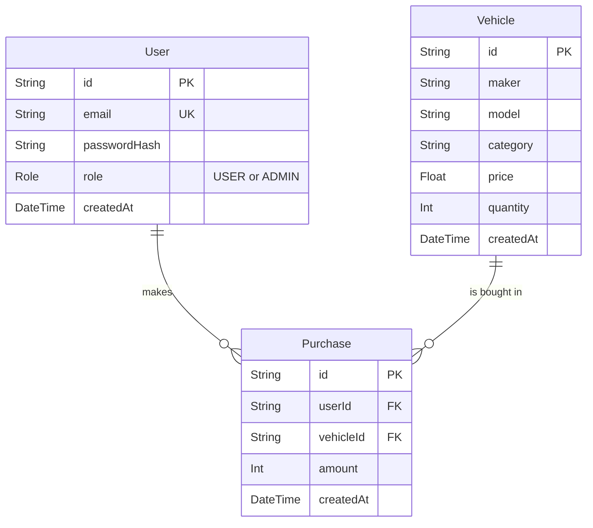

# Apex Motors - Car Dealership Inventory System

**Live Deployment:** [apexmotorsx.vercel.app](https://apexmotorsx.vercel.app)

A premium, full-stack web application engineered for modern car dealerships to meticulously manage inventory. Built from the ground up using a strict **Test-Driven Development (TDD)** approach, ensuring deep security, race-condition mitigation, and flawless business logic.

---

## 🚀 Key Features
- **Secure Authentication:** JWT-based stateless authentication with strict Role-Based Access Control (RBAC).
- **Admin Command Center:** Exclusive portal for Admins to add, edit, delete, and restock vehicles.
- **Dynamic Marketplace:** User-facing dashboard featuring real-time search, category filtering, and purchasing.
- **Atomic Concurrency Security:** Built-in Interactive Prisma Transactions to completely eliminate stock decrement race-conditions.
- **Flawless Premium UI:** Handcrafted using TailwindCSS v4 with dark mode persistence, glassmorphism, and minimal custom scrollbars.

---

## 🏗️ Architectural Overview

### The Tech Stack
* **Frontend:** React (Vite), TailwindCSS v4, React Router, Context API
* **Backend:** Node.js, Express, TypeScript, Bcrypt, JSON Web Tokens
* **Database Layer:** Prisma ORM, PostgreSQL (Neon.tech)
* **Testing Engine:** Jest, Supertest

### System Flow


### Database Schema


---

## 📂 Core File Structure

```text
ApexMotors/
├── backend/
│   ├── prisma/
│   │   ├── schema.prisma      # Core DB Models & Enum Declarations
│   │   └── seed.ts            # Optional seeding logic
│   ├── src/
│   │   ├── __tests__/         # TDD Test Suites (Auth, Vehicles, Edge Cases)
│   │   ├── middleware/        # JWT & RBAC Middleware
│   │   ├── routes/            # REST Controllers
│   │   ├── app.ts             # Express Configuration
│   │   └── server.ts          # Server Bootstrapper
│   └── package.json
│
├── frontend/
│   ├── src/
│   │   ├── components/        # Reusable UI (Navbar, Dialogs)
│   │   ├── context/           # AuthContext & ThemeContext
│   │   ├── pages/             # Dashboard, Admin, VehicleDetail views
│   │   ├── api.ts             # Centralized Fetch/Axios wrapper
│   │   └── App.tsx            # Global routing map
│   ├── tailwind.config.js     # Global design tokens
│   └── package.json
│
├── TESTCASE_README.md         # Exhaustive execution report of security tests
├── PROMPTS.md                 # AI Tooling history log
└── README.md                  # System Documentation
```

---

## ⚙️ Installation & Local Setup

### 1. Bootstrapping the Backend
The backend utilizes a cloud PostgreSQL database and is pre-configured for Vercel Serverless deployment.

```bash
cd backend
npm install

# Generate Prisma Client & Push the schema to create tables
npx prisma generate
npx prisma db push

# Start the development server (Defaults to Port 3001)
npm run dev
```

### 2. Bootstrapping the Frontend
In a separate terminal window:
```bash
cd frontend
npm install

# Start the Vite HMR server (Defaults to Port 5173)
npm run dev
```

### 3. Executing the Test Suites (TDD)
The core of this application was built using a Red-Green-Refactor pattern. You can verify the integrity of the system by executing the security and functionality tests.

```bash
cd backend
npm test
```
*Note: The test suite securely queries the database; always execute testing on an isolated database environment when not in local development to prevent data pollution.*

---

## 🔒 Security & Edge Case Handling
During development, significant focus was placed on eliminating critical e-commerce vulnerabilities:
1. **Stock Decrement Attacks:** Mitigated via absolute value validation (prevents restocking with negative numbers).
2. **Race Conditions:** Purchasing utilizes `prisma.$transaction()` with explicit rollbacks to guarantee that simultaneous requests cannot force vehicle stock into negative numbers.
3. **Role Bypass:** `requireAdmin` middleware rigorously intercepts unauthorized payload manipulations.

---

## 🤖 AI Usage Policy

This project was built in compliance with modern software engineering paradigms, strategically utilizing AI assistance (Antigravity/Gemini) to accelerate development while ensuring human oversight over business-critical logic.

**How AI Was Used:**
1. **Boilerplate Generation:** Bootstrapping the Express server and initial Prisma configuration.
2. **Regex Patterns:** Assisting with standard email validation strings.
3. **Responsive Grids:** Brainstorming optimal TailwindCSS grid constraints for mobile vs desktop views.
4. **Brainstorming Edge Cases:** Consulting on e-commerce race condition mitigation (Prisma Atomic Transactions) and attack vectors.

**Reflection:**
The use of AI dramatically reduced the time spent on trivial setup tasks and syntax lookup. However, the core architectural logic, TDD enforcement, and UI polish were manually driven. All AI-assisted actions are transparently logged in `PROMPTS.md` and explicitly tagged as `Co-authored-by: Gemini` within the Git commit history.
